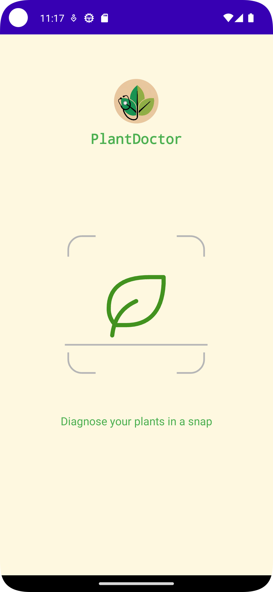
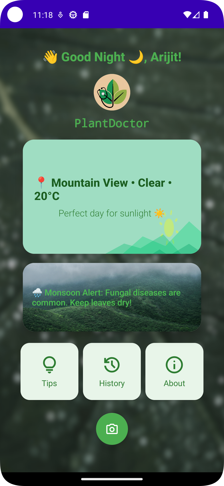
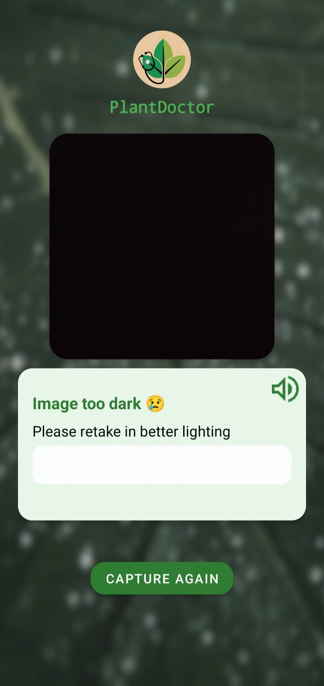
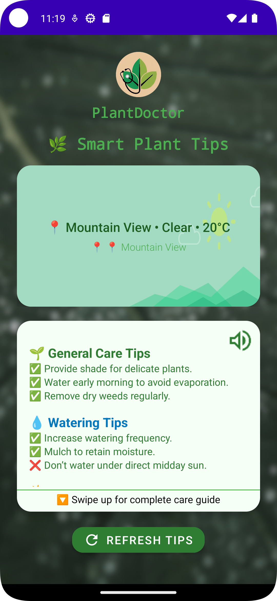
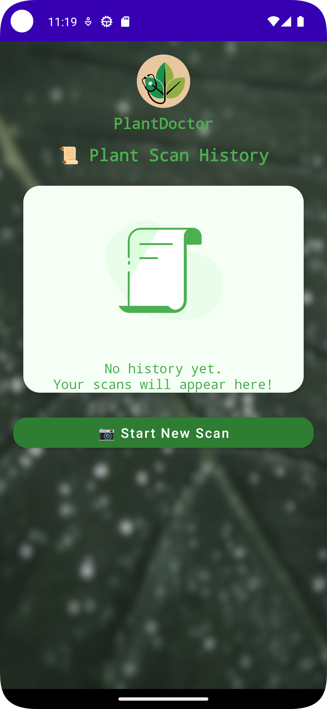

# PlantDoctor App Screenshots

<h2>App Screenshots</h2>

<table style="border-collapse: separate; border-spacing: 30px 40px; width: 100%;">
  <tr>
    <td style="text-align: center; border: none;">
      
<b>Splash Screen</b>

      
    </td>
    <td style="text-align: center; border: none;">
      
<b>Home Screen</b>

      
    </td>
    <td style="text-align: center; border: none;">
      
<b>Result Screen</b>

      
    </td>
  </tr>
  <tr>
    <td style="text-align: center; border: none;">
      
<b>Tips Screen</b>

      
    </td>
    <td style="text-align: center; border: none;">
      
<b>About Screen</b>

      
    </td>
    <td style="text-align: center; border: none;">
      
<b>History Screen</b>

      
    </td>
  </tr>
</table>
