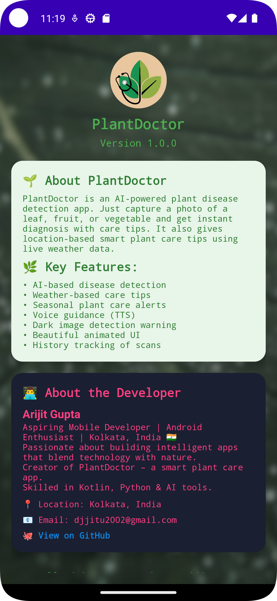

# PlantDoctor App Screenshots

<table>
  <tr>
    <td>
      
       <b>Splash Screen</b>
    </td>
    <td>
      
       <b>Home Screen</b>
    </td>
  </tr>
  <tr>
    <td>
      
       <b>Result Screen</b>
    </td>
    <td>
      
       <b>Tips Screen</b>
    </td>
  </tr>
  <tr>
    <td>
      
       <b>About Screen</b>
    </td>
    <td>
      
       <b>History Screen</b>
    </td>
  </tr>
</table>
